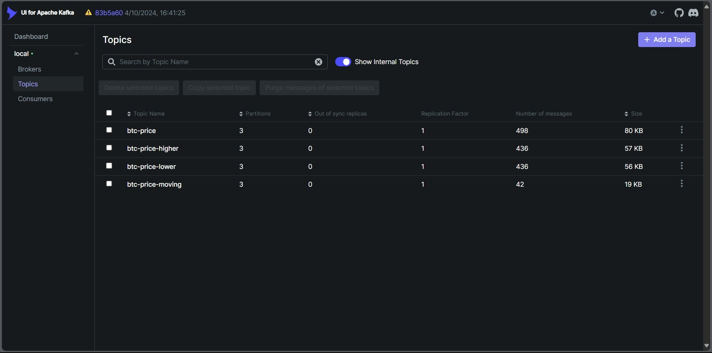

# How to run Kafka
To run the application, navigate to `src/` directory and call:
```bash
./run-application.sh
```
Kafka UI can be accessed via `localhost:8082`. 

To shut down the application:
```bash
docker compose down
```
If you use Ctrl+C or `docker compose stop` to stop, it may cause errors. You may try to use the above command.

# How to run 22120210_zscore.ipynb
To facilitate debugging, our team has executed the z-score computation using a notebook file. The notebook can be accessed for execution and editing via `localhost:8890`. Please note the following when running the code:
1. To perform Z-score calculations, this notebook must be run ENTIRELY MANUALLY, following the detailed instructions provided in each cell.

2. The **\[Debug section]** is intended for inspecting output during development. Do **not** run these cells if your goal is simply to publish the z-score results to MongoDB.

3. In the last cell of the notebook, the code will throw an error if required Kafka topics such as `btc-price` and `btc-price-moving` do not yet exist. To check whether these topics are available, open the Kafka UI mentioned earlier and go to the **Topics** section (see illustration below).


